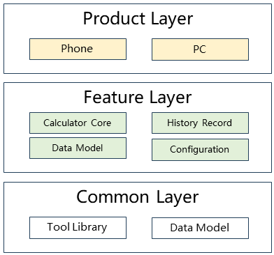

# Calculator Application

## Introduction

`Calculator` is a basic calculator application in the OpenHarmony system, providing standard calculator and scientific calculator functions, with support for history record management. The application is developed using the ArkTS language, based on the OpenHarmony Stage model, supports multiple device forms including Phone, Tablet, and PC, supports foldable devices, and features responsive layout, multi-device adaptation, and accessibility support.

Calculator includes the following common features:

* **Standard Calculator**: Supports basic arithmetic operations, percentage, square root, and other common calculation functions.
* **Scientific Calculator**: Fully displayed only in landscape mode, supports trigonometric functions, logarithms, exponents, factorials, and other advanced mathematical operations. Some advanced mathematical functions have precision limitations.
* **History Records**: Automatically saves calculation history, supports viewing, copying, and deleting history records, with a maximum of 100 history records.
* **Multi-Device Adaptation**: Supports multiple device forms such as phones, tablets, and PCs, automatically adapting to different screen sizes.
* **Memory Functions**: Supports M+, M-, MR, MC and other memory operations.
* **Angle/Radian Conversion**: Scientific calculator supports switching between angle and radian modes.

## System Architecture

<div align="center">
  
  <br>
  <b>Figure 1</b> Calculator Application System Architecture Diagram
</div>

### Module Function Description

The overall architecture adopts a modular design, divided into application layer, feature layer, common layer, and product layer.

* **Product Layer**
  * **Phone Entry**: Phone/tablet device entry module, responsible for application Ability lifecycle management, page routing, and device-specific adaptation.
  * **PC Entry**: PC device entry module, providing PC-specific interaction methods and layout adaptation.

* **Feature Layer**
  * **Calculator Core Components**: Contains core UI components such as numeric panel, operation view, and calculation engine.
  * **History Record Components**: Provides history record display, management, and interaction functions.
  * **Data Models**: Manages data models for expressions, calculation results, and history records.
  * **Configuration Information**: Defines key codes, text, sizes, and other configuration information.

* **Common Layer**
  * **Utility Libraries**: Provides basic functions such as database operations, logging, common utilities, and breakpoint system.
  * **Data Models**: Defines globally common database table structures and data objects
    * **TableData**: Includes field definitions for calculation expressions, database configuration, and common query statements, supporting persistent storage of history records.
    * **LooseObject**: Used for history record data transmission, supports date grouping and database ID mapping, as well as simplified data structures for history record list display, implementing data conversion between database records and application UI.

### Key Interaction Flows

#### Calculation Flow


1. **User Input**: User clicks buttons on the numeric panel, triggering the `handleInput` method of `DigitPanelController`.
2. **Input Processing**: The controller updates the expression state based on the key type (number, operator, function, etc.).
3. **Calculation Execution**: When the user clicks the equal sign, the controller calls `Evaluator` to perform the calculation.
4. **Worker Calculation**: `Evaluator` sends the calculation task to a Worker thread and uses the `mathjs` library for mathematical operations.
5. **Result Return**: After the Worker completes the calculation, it returns the result to the main thread through a callback.
6. **UI Update**: The main thread updates the display area to show the calculation result.
7. **History Record**: If the calculation is successful, the expression and result are saved to the database.

#### History Record Management Flow


1. **Save Record**: After each successful calculation, the expression and result are inserted into the database through `RdbHelper`.
2. **Query Records**: When the user accesses the history record page, the latest 100 records are queried from the database.
3. **Display Records**: Use the `LazyForEach` component to lazily load and display the history record list.
4. **Copy Result**: Users can copy the result of a single history record to the clipboard.
5. **Delete Record**: Supports deleting a single record or clearing all history records.

## Directory Structure

The project directory structure is as follows:

```
applications_calculator-master/          # Calculator application root directory
├── AppScope/                            # Application global configuration
│   └── resources/                       # Global resource files
│       ├── base/                        # Base resources
│       ├── zh_CN/                       # Simplified Chinese resources
│       └── en/                          # English resources
├── common/                              # Common HAR module
│   ├── src/main/ets/
│   │   ├── util/                        # Utility classes
│   │   │   ├── RdbHelper.ets           # Database helper
│   │   │   ├── CommonUtil.ets          # Common utilities
│   │   │   ├── LogUtil.ets             # Logging utility
│   │   │   ├── BreakpointSystem.ets    # Breakpoint system
│   │   │   └── AccessibilityPlayUtil.ets # Accessibility utility
│   │   └── data/                        # Data models
│   │       ├── TableData.ets           # Database table definition
│   │       └── LooseObject.ets         # Common object
│   └── build-profile.json5              # Module build configuration
├── feature/calculation/                 # Calculation feature HAR module
│   ├── src/main/ets/
│   │   ├── calculator/                  # Calculator core components
│   │   │   ├── Evaluator.ets           # Calculation engine
│   │   │   ├── DigitPanel.ets          # Numeric panel UI
│   │   │   ├── DigitPanelController.ets # Panel controller
│   │   │   ├── OperationView.ets       # Operation view
│   │   │   ├── OperationViewPC.ets     # PC operation view
│   │   │   ├── KeyCode.ets             # Key code definition
│   │   │   └── KeyText.ets             # Key text
│   │   ├── historyrecord/              # History record functionality
│   │   │   ├── HistoryRecord.ets       # History record component
│   │   │   ├── HistoryRecordPC.ets     # PC history record
│   │   │   ├── HistoryRecordController.ets # History record controller
│   │   │   └── TitleBar.ets            # Title bar
│   │   ├── model/                      # Data models
│   │   │   ├── ExpressionsModel.ets    # Expression model
│   │   │   ├── ExpressionsDataSource.ets # Expression data source
│   │   │   └── DigitPanelModel.ets     # Numeric panel model
│   │   ├── views/                      # View components
│   │   │   ├── PhysicsButton.ets       # Physical button
│   │   │   └── EqualViewBorder.ets     # Equal sign view border
│   │   └── info/                       # Configuration information
│   │       ├── PhysicsButtonInfo.ets   # Button information
│   │       ├── PanelSizeInfo.ets       # Panel size
│   │       └── AccessibilityInfo.ets   # Accessibility information
│   └── build-profile.json5              # Module build configuration
├── product/phone/                       # Phone/tablet Entry module
│   ├── src/main/ets/
│   │   ├── pages/                      # Pages
│   │   │   ├── main.ets                # Main page
│   │   │   └── historyRecordPage.ets   # History record page
│   │   ├── Ability/                    # Ability
│   │   │   └── CalculatorAbility.ets   # Calculator Ability
│   │   ├── Application/                # Application entry
│   │   │   └── CalculatorAbilityStage.ets # AbilityStage
│   │   ├── workers/                    # Worker threads
│   │   │   └── WorkerUtil.ets          # Worker utility
│   │   └── phoneformability/           # Card ability
│   │       └── PhoneFormAbility.ets    # Phone card
│   ├── src/ohosTest/                   # Test code
│   │   └── ets/test/                   # Unit tests
│   └── build-profile.json5              # Module build configuration
├── product/pc/                          # PC Entry module
│   ├── src/main/ets/
│   │   ├── pages/                      # Pages
│   │   │   ├── main.ets                # Main page
│   │   │   └── historyRecordPage.ets   # History record page
│   │   ├── Ability/                    # Ability
│   │   │   └── CalculatorAbility.ets   # Calculator Ability
│   │   ├── Application/                # Application entry
│   │   │   └── CalculatorAbilityStage.ets # AbilityStage
│   │   └── workers/                    # Worker threads
│   │       └── WorkerUtil.ets          # Worker utility
│   └── build-profile.json5              # Module build configuration
├── oh-package.json5                     # Dependency management
├── build-profile.json5                  # Project build configuration
├── hvigorfile.ts                        # Build script
└── README_zh.md                         # Chinese documentation
```

## Building

Use the following commands to build for different target platforms:

### Build with DevEco Studio

1. Open the project in DevEco Studio
2. Select Build → Build Haps(s)/APP(s) → Build Hap(s)
3. After compilation, the hap package will be generated in the `build/outputs` directory

### Build with Command Line

**Build Calculator Application**

```bash
./build.sh --product-name rk3568 --ccache --build-target calculator
```

**Install hap Package**

```bash
hdc install "hap_package_path"
```

> **Note:**
> `--product-name`: Product name, such as `rk3568`, `Hi3516DV300`, etc.
> `--ccache`: Use cache during compilation.
> `--build-target`: Name of the component to build.

## Usage Instructions

### Interface Description

Calculator application mainly uses the following OpenHarmony APIs:

**Table 1** Main Interface Description

| Interface Name | Function Description |
|---------|---------|
| **@ohos.worker** | Worker threads for background calculation |
| **@ohos.data.relationalStore** | Relational database for storing history records |
| **@ohos.data.preferences** | Preferences for persistent configuration |
| **@ohos.window** | Window management for controlling screen orientation |
| **@ohos.display** | Display management for obtaining screen information |

### Development Steps

The following demonstrates the key steps for developing the calculator application:

1. **Create Project Structure**: Create project directory according to modular design.
2. **Implement Calculation Engine**: Use `mathjs` library to implement mathematical calculation functions.
3. **Build UI Components**: Use ArkTS declarative UI to build calculator interface.
4. **Implement State Management**: Use `@State`, `@StorageLink` and other decorators to manage application state.
5. **Add History Records**: Use RDB to store and query history records.
6. **Multi-Device Adaptation**: Use breakpoint system to implement responsive layout.
7. **Add Accessibility Support**: Add accessibility identifiers for key UI elements.

#### Code Examples

**Example 1: Create Calculator Main Page**

```typescript
@Entry
@Component
struct Main {
  @State result: string = ''
  private mDigitPanelController: DigitPanelController = DigitPanelController.getInstance()

  build() {
    Column() {
      // Operation view
      OperationView({ result: $result })

      // Numeric panel
      DigitPanel({
        inputValue: this.inputValue,
        panelSizeInfo: this.panelSizeInfo
      })
    }
    .width('100%')
    .height('100%')
  }

  private inputValue = (value: PhysicsButtonInfo) => {
    this.mDigitPanelController.handleInput((res: Record<string, string>) => {
      this.result = res.result
    }, value)
  }
}
```

**Example 2: Use Worker for Calculation**

```typescript
// Execute calculation in Worker
worker.onmessage = function(e) {
  const expression = e.data.expression
  const result = math.evaluate(expression) // Calculate using mathjs
  worker.postMessage({ result: result.toString() })
}

// Call in main thread
worker.postMessage({ expression: '2 + 2' })
```

**Example 3: Save History Record**

```typescript
// Save history record using RdbHelper
const rdbHelper = RdbHelper.getInstance()
rdbHelper.insertHistoryRecord({
  expression: '2 + 2',
  result: '4',
  timestamp: Date.now()
})
```

#### Notes

* **Worker Usage**: Computation-intensive operations must be executed in Worker to avoid blocking the UI thread.
* **State Management**: Use `PersistentStorage.persistProp()` to persist key states to ensure state retention after application restart.
* **Database Operations**: RdbHelper adopts singleton pattern to ensure uniqueness of database connection.
* **Multi-thread Safety**: Avoid directly manipulating UI in Worker, update UI through callbacks or message passing.
* **Memory Management**: Release unused resources in time to avoid memory leaks.
* **Accessibility Support**: Set `id` and appropriate `accessibilityText` for all interactive UI elements.

## Constraints

* **Development Environment**
  * **DevEco Studio for OpenHarmony**: Version greater than 3.1.1.101
  * **SDK Version**: OpenHarmony SDK API Version 23
  * **Language Version**: ArkTS

* **Dependency Libraries**
  * mathjs: 11.2.0 (Mathematical calculation library)
  * @ohos/hypium: 1.0.9 (Testing framework)

## Related Repositories

[OpenHarmony Application Development Documentation](https://gitcode.com/openharmony/docs/blob/master/zh-cn/application-dev/README.md)<br>
[ArkTS Language Guide](https://gitcode.com/openharmony/docs/blob/master/zh-cn/application-dev/arkts-get-started.md)<br>
[Stage Model Development](https://gitcode.com/openharmony/docs/blob/master/zh-cn/application-dev/ui/arkts-architecture-overview.md)<br>
[UI Development Guide](https://gitcode.com/openharmony/docs/blob/master/zh-cn/application-dev/ui/arkts-ui-development.md)