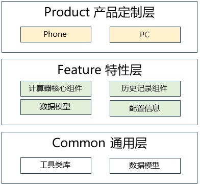

# 计算器应用

## 简介
`Calculator` 是 OpenHarmony 系统中的基础计算器应用，提供标准计算器和科学计算器功能，并支持历史记录管理。该应用采用 ArkTS 语言开发，基于 OpenHarmony Stage 模型，支持 Phone、Tablet 和 PC 多种设备形态，支持折叠屏设备，具备响应式布局和多设备适配等特性。

Calculator 包含以下常用功能：

* **标准计算器**：支持基本的四则运算、百分比、平方根等常用计算功能。
* **科学计算器**：仅在横屏模式下完全显示，支持三角函数、对数、指数、阶乘等高级数学运算，部分高级数学函数存在精度限制。
* **历史记录**：自动保存计算历史，支持查看、复制和删除历史记录，最大历史记录数100 条。
* **多设备适配**：支持手机、平板、PC 等多种设备形态，自动适配不同屏幕尺寸。
* **内存功能**：支持 M+、M-、MR、MC 等内存操作。
* **角度/弧度转换**：科学计算器支持角度和弧度两种模式切换。

## 系统架构

<div align="center">
  
  <br>
  <b>图 1</b> 计算器应用系统架构图
</div>

### 模块功能说明

整体架构采用模块化设计，划分为应用层、特性层、公共层和产品层。

* **产品定制层 (Product Layer)**
  * **Phone Entry**: 手机/平板设备入口模块，负责应用的 Ability 生命周期管理、页面路由和设备特定适配。
  * **PC Entry**: PC 设备入口模块，提供 PC 端的特定交互方式和布局适配。

* **特性层 (Feature Layer)**
  * **计算器核心组件**: 包含数字面板、操作视图、计算引擎等核心 UI 组件。
  * **历史记录组件**: 提供历史记录的展示、管理和交互功能。
  * **数据模型**: 管理表达式、计算结果和历史记录的数据模型。
  * **配置信息**: 定义按键编码、文本、尺寸等配置信息。

* **通用层 (Common Layer)**
  * **工具类库**: 提供数据库操作、日志记录、通用工具、断点系统等基础功能。
  * **数据模型**: 定义全局通用的数据库表结构和数据对象
    * **TableData**: 包括计算表达式的字段定义、数据库配置和常用查询语句，支持历史记录的持久化存储。
    * **LooseObject**: 用于历史记录数据传递、支持日期分组和数据库ID映射， 以及历史记录列表展示的简化数据结构，实现数据库记录与应用UI之间的数据转换。

### 关键交互流程

#### 计算流程


1. **用户输入**: 用户点击数字面板上的按钮，触发 `DigitPanelController` 的 `handleInput` 方法。
2. **输入处理**: 控制器根据按键类型（数字、运算符、函数等）更新表达式状态。
3. **计算执行**: 当用户点击等号时，控制器调用 `Evaluator` 进行计算。
4. **Worker 计算**: `Evaluator` 将计算任务发送到 Worker 线程，使用 `mathjs` 库进行数学运算。
5. **结果返回**: Worker 计算完成后，通过回调将结果返回到主线程。
6. **UI 更新**: 主线程更新显示区域，展示计算结果。
7. **历史记录**: 如果计算成功，将表达式和结果保存到数据库。

#### 历史记录管理流程


1. **保存记录**: 每次计算成功后，通过 `RdbHelper` 将表达式和结果插入到数据库。
2. **查询记录**: 用户访问历史记录页面时，从数据库查询最新的 100 条记录。
3. **展示记录**: 使用 `LazyForEach` 组件懒加载展示历史记录列表。
4. **复制结果**: 用户可以复制单条历史记录的结果到剪贴板。
5. **删除记录**: 支持删除单条记录或清空所有历史记录。

## 目录

项目目录结构如下：

```
applications_calculator-master/          # 计算器应用根目录
├── AppScope/                            # 应用全局配置
│   └── resources/                       # 全局资源文件
│       ├── base/                        # 基础资源
│       ├── zh_CN/                       # 简体中文资源
│       └── en/                          # 英文资源
├── common/                              # 公共 HAR 模块
│   ├── src/main/ets/
│   │   ├── util/                        # 工具类
│   │   │   ├── RdbHelper.ets           # 数据库助手
│   │   │   ├── CommonUtil.ets          # 通用工具
│   │   │   ├── LogUtil.ets             # 日志工具
│   │   │   ├── BreakpointSystem.ets    # 断点系统
│   │   │   └── AccessibilityPlayUtil.ets # 无障碍工具
│   │   └── data/                        # 数据模型
│   │       ├── TableData.ets           # 数据库表定义
│   │       └── LooseObject.ets         # 通用对象
│   └── build-profile.json5              # 模块构建配置
├── feature/calculation/                 # 计算功能 HAR 模块
│   ├── src/main/ets/
│   │   ├── calculator/                  # 计算器核心组件
│   │   │   ├── Evaluator.ets           # 计算引擎
│   │   │   ├── DigitPanel.ets          # 数字面板 UI
│   │   │   ├── DigitPanelController.ets # 面板控制器
│   │   │   ├── OperationView.ets       # 操作视图
│   │   │   ├── OperationViewPC.ets     # PC 操作视图
│   │   │   ├── KeyCode.ets             # 按键码定义
│   │   │   └── KeyText.ets             # 按键文本
│   │   ├── historyrecord/              # 历史记录功能
│   │   │   ├── HistoryRecord.ets       # 历史记录组件
│   │   │   ├── HistoryRecordPC.ets     # PC 历史记录
│   │   │   ├── HistoryRecordController.ets # 历史记录控制器
│   │   │   └── TitleBar.ets            # 标题栏
│   │   ├── model/                      # 数据模型
│   │   │   ├── ExpressionsModel.ets    # 表达式模型
│   │   │   ├── ExpressionsDataSource.ets # 表达式数据源
│   │   │   └── DigitPanelModel.ets     # 数字面板模型
│   │   ├── views/                      # 视图组件
│   │   │   ├── PhysicsButton.ets       # 物理按钮
│   │   │   └── EqualViewBorder.ets     # 等号视图边框
│   │   └── info/                       # 配置信息
│   │       ├── PhysicsButtonInfo.ets   # 按钮信息
│   │       ├── PanelSizeInfo.ets       # 面板尺寸
│   │       └── AccessibilityInfo.ets   # 无障碍信息
│   └── build-profile.json5              # 模块构建配置
├── product/phone/                       # 手机/平板 Entry 模块
│   ├── src/main/ets/
│   │   ├── pages/                      # 页面
│   │   │   ├── main.ets                # 主页面
│   │   │   └── historyRecordPage.ets   # 历史记录页面
│   │   ├── Ability/                    # Ability
│   │   │   └── CalculatorAbility.ets   # 计算器 Ability
│   │   ├── Application/                # 应用入口
│   │   │   └── CalculatorAbilityStage.ets # AbilityStage
│   │   ├── workers/                    # Worker 线程
│   │   │   └── WorkerUtil.ets          # Worker 工具
│   │   └── phoneformability/           # 卡片能力
│   │       └── PhoneFormAbility.ets    # 手机卡片
│   ├── src/ohosTest/                   # 测试代码
│   │   └── ets/test/                   # 单元测试
│   └── build-profile.json5              # 模块构建配置
├── product/pc/                          # PC Entry 模块
│   ├── src/main/ets/
│   │   ├── pages/                      # 页面
│   │   │   ├── main.ets                # 主页面
│   │   │   └── historyRecordPage.ets   # 历史记录页面
│   │   ├── Ability/                    # Ability
│   │   │   └── CalculatorAbility.ets   # 计算器 Ability
│   │   ├── Application/                # 应用入口
│   │   │   └── CalculatorAbilityStage.ets # AbilityStage
│   │   └── workers/                    # Worker 线程
│   │       └── WorkerUtil.ets          # Worker 工具
│   └── build-profile.json5              # 模块构建配置
├── oh-package.json5                     # 依赖管理
├── build-profile.json5                  # 项目构建配置
├── hvigorfile.ts                        # 构建脚本
└── README_zh.md                         # 中文说明文档
```

## 编译构建

根据不同的目标平台，使用以下命令进行编译：

### 基于 DevEco Studio 构建

1. 在 DevEco Studio 打开项目工程
2. 选择 Build → Build Haps(s)/APP(s) → Build Hap(s)
3. 编译完成后，hap 包会生成在 `build/outputs` 目录下

### 基于命令行构建

**编译计算器应用**

```bash
./build.sh --product-name rk3568 --ccache --build-target calculator
```

**安装 hap 包**

```bash
hdc install "hap包路径"
```

> **说明：**
> `--product-name`: 产品名称，例如 `rk3568`、`Hi3516DV300` 等。
> `--ccache`: 编译时使用缓存功能。
> `--build-target`: 编译的部件名称。

## 使用说明

### 接口说明

Calculator 应用主要使用以下 OpenHarmony API：

**表 1** 主要接口说明

| 接口名称 | 功能描述 |
|---------|---------|
| **@ohos.worker** | Worker 线程，用于后台计算 |
| **@ohos.data.relationalStore** | 关系型数据库，用于存储历史记录 |
| **@ohos.data.preferences** | 持久化配置 |
| **@ohos.window** | 窗口管理，用于控制屏幕方向 |
| **@ohos.display** | 显示管理，用于获取屏幕信息 |

### 开发步骤

以下演示开发计算器应用的关键步骤：

1. **创建项目结构**：按照模块化设计创建项目目录。
2. **实现计算引擎**：使用 `mathjs` 库实现数学计算功能。
3. **构建 UI 组件**：使用 ArkTS 声明式 UI 构建计算器界面。
4. **实现状态管理**：使用 `@State`、`@StorageLink` 等装饰器管理应用状态。
5. **添加历史记录**：使用 RDB 存储和查询历史记录。
6. **多设备适配**：使用断点系统实现响应式布局。
7. **添加无障碍支持**：为关键 UI 元素添加无障碍标识。

#### 代码示例

**示例 1：创建计算器主页面**

```typescript
@Entry
@Component
struct Main {
  @State result: string = ''
  private mDigitPanelController: DigitPanelController = DigitPanelController.getInstance()
  
  build() {
    Column() {
      // 操作视图
      OperationView({ result: $result })
      
      // 数字面板
      DigitPanel({
        inputValue: this.inputValue,
        panelSizeInfo: this.panelSizeInfo
      })
    }
    .width('100%')
    .height('100%')
  }
  
  private inputValue = (value: PhysicsButtonInfo) => {
    this.mDigitPanelController.handleInput((res: Record<string, string>) => {
      this.result = res.result
    }, value)
  }
}
```

**示例 2：使用 Worker 进行计算**

```typescript
// 在 Worker 中执行计算
worker.onmessage = function(e) {
  const expression = e.data.expression
  const result = math.evaluate(expression) // 使用 mathjs 计算
  worker.postMessage({ result: result.toString() })
}

// 在主线程中调用
worker.postMessage({ expression: '2 + 2' })
```

**示例 3：保存历史记录**

```typescript
// 使用 RdbHelper 保存历史记录
const rdbHelper = RdbHelper.getInstance()
rdbHelper.insertHistoryRecord({
  expression: '2 + 2',
  result: '4',
  timestamp: Date.now()
})
```

#### 注意事项

* **Worker 使用**：计算密集型操作必须在 Worker 中执行，避免阻塞 UI 线程。
* **状态管理**：使用 `PersistentStorage.persistProp()` 持久化关键状态，确保应用重启后状态保持。
* **数据库操作**：RdbHelper 采用单例模式，确保数据库连接的唯一性。
* **多线程安全**：避免在 Worker 中直接操作 UI，通过回调或消息传递更新 UI。
* **内存管理**：及时释放不再使用的资源，避免内存泄漏。
* **无障碍支持**：为所有可交互的 UI 元素设置 `id` 和适当的 `accessibilityText`。

## 约束

* **开发环境**
  * **DevEco Studio for OpenHarmony**: 版本号大于 3.1.1.101
  * **SDK 版本**: OpenHarmony SDK API Version 23
  * **语言版本**: ArkTS

* **依赖库**
  * mathjs: 11.2.0（数学计算库）
  * @ohos/hypium: 1.0.9（测试框架）

## 相关仓

[OpenHarmony 应用开发文档](https://gitcode.com/openharmony/docs/blob/master/zh-cn/application-dev/README.md)<br>
[ArkTS 语言指南](https://gitcode.com/openharmony/docs/blob/master/zh-cn/application-dev/arkts-get-started.md)<br>
[Stage 模型开发](https://gitcode.com/openharmony/docs/blob/master/zh-cn/application-dev/ui/arkts-architecture-overview.md)<br>
[UI 开发指南](https://gitcode.com/openharmony/docs/blob/master/zh-cn/application-dev/ui/arkts-ui-development.md)