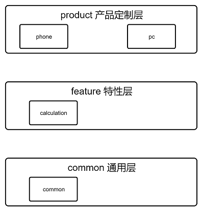
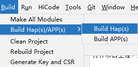
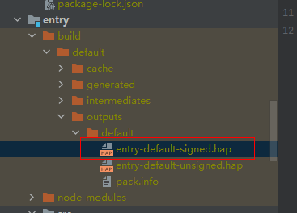
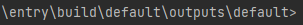
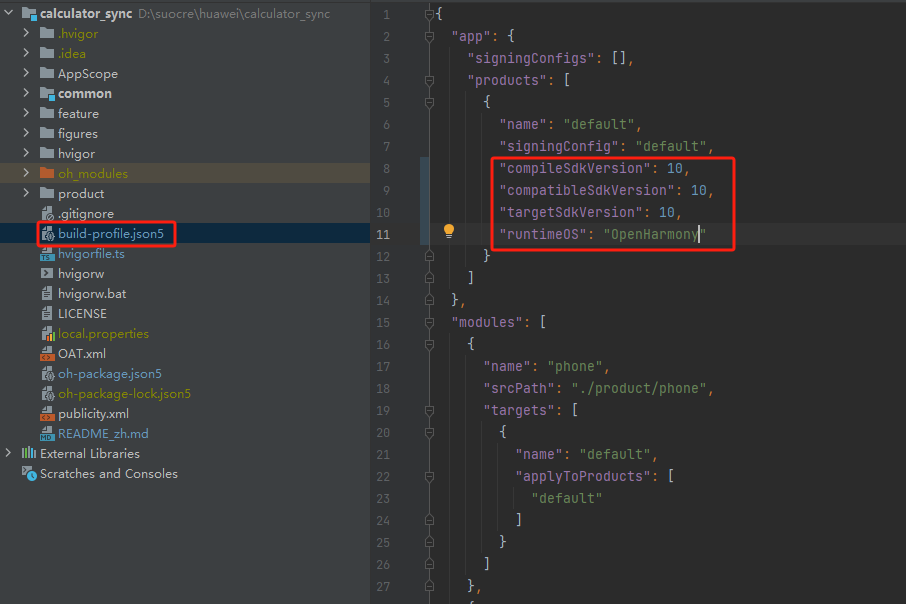
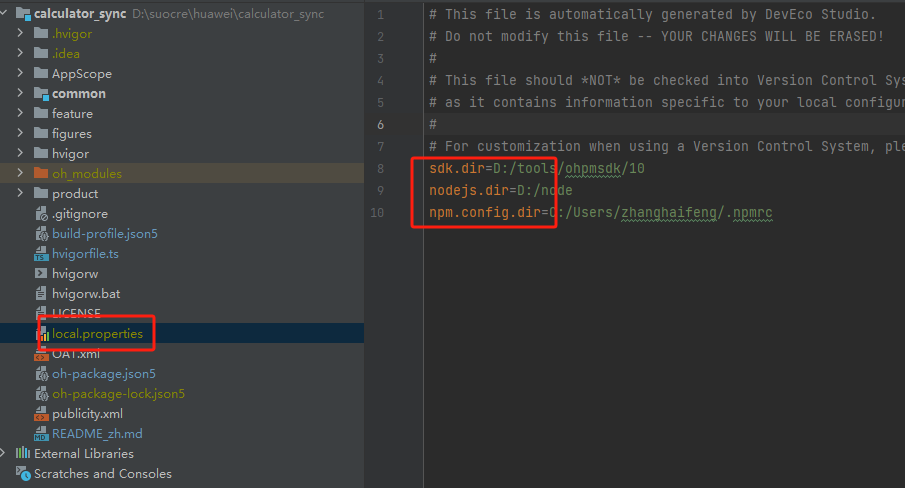

# 计算器应用

## 项目介绍

计算器应用，提供标准计算器和历史记录功能。

## 目录结构
```
├─AppScope
│  │  
│  └─resources                       # 资源文件 
├─common
│  │  
│  └─src
│      └─main  
│          └─ets                     # 公共方法            
├─feature
│  │
│  └─calculation 
│     │ 
│     └─src
│        └─main
│           └─ets                    # 基本特性                                         
├─product
│  │
│  └─phone 
│      └─src
│         └─main 
│              └─ets                 # 手机/pad程序入口  
├─product
│  │
│  └─pc 
│      └─src
│         └─main 
│              └─ets                 # pc程序入口   
├─open_source                        # 引入的第三方库开源声明                              
└─hw_sign                            # 签名文件
```


### 整体架构





Calculator作为基础应用，实现标准计算器和历史记录功能。
  
## 使用说明

### 基于IDE构建

在DevEco Studio打开项目工程，选择Build → Build Haps(s)/APP(s) → Build Hap(s)。



编译完成后，hap包会生成在工程目录下的 `\build\outputs`路径下。（如果没有配置签名，则只会生成未签名的hap包）



使用hdc install "hap包地址" 命令进行安装编译后的hap包。



在测试机上运行 配置OpenHarmony版本


根据本地环境配置sdk


### 基于OpenHarmony版本构建

在OpenHarmony源码目录下，调用一下命令，单独编译calculator

```
./build.sh --product-name rk3568 --ccache --build-target calculator
```
> **说明：**
--product-name：产品名称，例如Hi3516DV300、rk3568等。
--ccache：编译时使用缓存功能。
--build-target: 编译的部件名称。

## 约束
- 开发环境
   - **DevEco Studio for OpenHarmony**: 版本号大于3.1.1.101，下载安装OpenHarmony SDK API Version 11。（初始的IDE配置可以参考IDE的使用文档）
- 语言版本
   - ArkTS
- 限制
   - 本示例仅支持标准系统上运行


